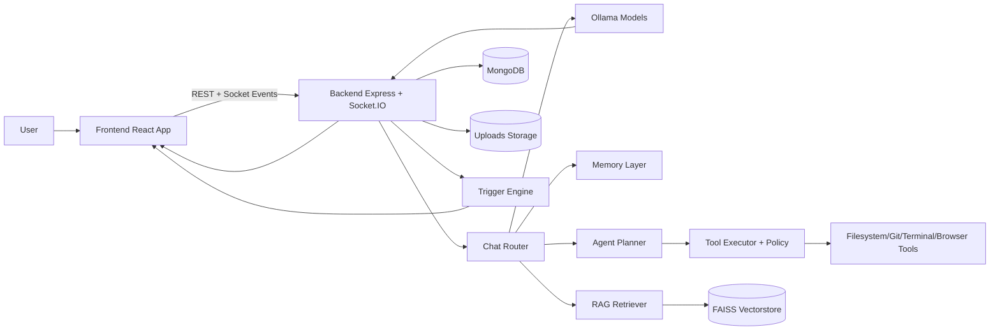
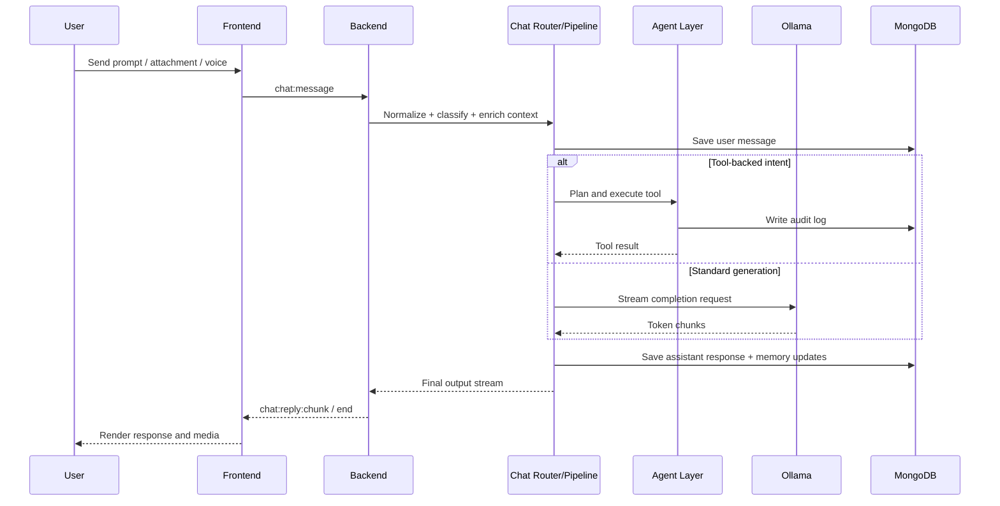

# SYNAPSE Project Presentation Script

## 1. Opening Pitch (60-90 seconds)
Hello everyone.

Today I am presenting SYNAPSE, a local-first AI assistant platform designed to deliver fast, private, and extensible intelligence directly on a developer machine.

Most AI assistants are cloud-only and limited to chat. SYNAPSE is different.
It combines real-time conversation, multi-model routing, memory, tool usage, and proactive triggers in one integrated system.

In simple terms, SYNAPSE is built to understand, reason, act safely, and remember over time.

The core value proposition is:
- privacy by running models locally with Ollama
- reliability through modular backend architecture
- extensibility through agent tools and event-driven design
- usability through a live, interactive frontend control surface

---

## 2. Problem Statement
Developers and advanced users need an AI assistant that can:
- run with low latency on local hardware
- maintain conversation context and memory
- interact with files, system state, and web data safely
- support text, voice, and document workflows in one place

Most existing assistants solve only one or two of these needs. SYNAPSE solves them together.

---

## 3. Solution Overview
SYNAPSE is a full-stack system with two primary planes:
- execution plane (backend): orchestration, tools, memory, routing, queueing, sockets
- interaction plane (frontend): chat interface, memory panel, trigger panel, system panel, agent debug controls

Core capabilities already in place:
- Socket streaming chat with persistent sessions
- Multi-model routing for casual, reasoning, coding, and vision tasks
- Memory architecture (fact, profile, episodic, session)
- Agent tool execution with policy checks and audit logging
- Trigger and proactive alert foundation
- File upload and parsing pipeline (images, PDF, audio)

---

## 4. File and Folder Structure with Workflow

### 4.1 Top-Level Structure
- backend: all server-side logic, APIs, sockets, services, models, tools
- frontend: React + Vite interface and interactive panels
- Docs: architecture, implementation reports, roadmap, testing and design reports
- cli and desktop: expansion points for command-line and desktop integrations

### 4.2 Backend Folder Workflow (How data moves through backend folders)
1. app.js initializes Express, security middleware, Socket.IO, routes, and workers.
2. config centralizes environment, DB, and socket setup.
3. routes receives HTTP requests and delegates to services.
4. sockets receives real-time events and delegates to chat pipeline or agent execution.
5. services handles business logic: routing, LLM invocation, search, voice, PDF, proactive engine.
6. agent plans tool usage, enforces policy, executes tool, and logs audit trail.
7. tools runs constrained operations (git, filesystem, terminal, browser).
8. memory extracts and stores facts and episodes for future context.
9. rag ingests and retrieves contextual knowledge from vectorstore.
10. queues manages background and resource-aware jobs.
11. models persists long-lived state in MongoDB.
12. triggers schedules and emits proactive events.

### 4.3 Frontend Folder Workflow
1. App.jsx maintains socket lifecycle, auth state, and global interaction state.
2. components/ChatWindow and InputBar drive conversation input/output.
3. MessageBubble renders markdown, code blocks, and attachments.
4. Sidebar and panels expose memory, trigger alerts, system status, and agent debug data.
5. Visual components (Avatar, particles, status ring) improve user feedback and usability.

---

## 5. Data Flow Diagram (High-Level)

---

## 6. Chat Request Sequence (Detailed Workflow)

---

## 7. Concept Explanation for Audience

### 7.1 Core Concept
SYNAPSE follows a Sense, Think, Act, Remember loop:
- Sense: intake from text, voice, files, and system context
- Think: classify intent and select model or tool strategy
- Act: execute chat generation or safe tool operations
- Remember: store facts and episodes to improve future responses

### 7.2 Why this concept is important
- It shifts from one-shot chatbot behavior to assistant behavior.
- It supports continuity and personalization without losing control.
- It keeps safety and observability by design through policy and audit layers.

---

## 8. Architecture Advantages
- Modular, service-oriented backend separation
- Real-time UX with Socket.IO streaming
- Multi-model flexibility for workload-specific efficiency
- Clear safety path for tool execution
- Long-term extensibility for proactive and autonomous scenarios

---

## 9. Current Status and What We Are Doing
Current state:
- Foundational platform capabilities are implemented and integrated.
- Memory, tooling, routing, proactive triggers, and system visibility are live.

Current active direction:
- strengthen agent planning depth and multi-step execution quality
- improve write-safe tooling with stronger confirmation UX
- expand desktop-level perception and automation hooks
- continue UI evolution from chat-first to mission-control style assistant

---

## 10. Closing Script (30-45 seconds)
SYNAPSE demonstrates that a local AI assistant can be more than a chat window.
It can reason with context, operate with guardrails, and evolve into an actionable assistant platform.

The project is intentionally architecture-first, so every new capability can plug into a stable core.

Thank you.
I am ready to walk through a live demo of chat, memory, tools, and proactive alerts.
