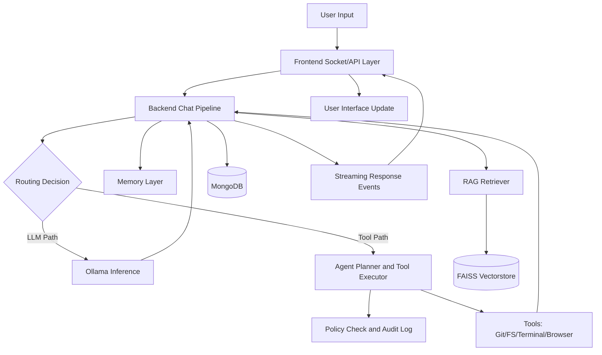

# SYNAPSE Project Report

## 1. Executive Summary
SYNAPSE is a local-first, full-stack AI assistant platform that combines multi-model intelligence, real-time interaction, persistent memory, and safe tool execution.

The system is designed for users who require privacy, low latency, and high control over AI behavior in a development-centric environment.

---

## 2. Objective
Build a production-oriented local AI assistant platform that:
- runs on local infrastructure with Ollama-hosted models
- supports streaming chat, multimodal inputs, and contextual memory
- executes controlled tool actions with safety policies and auditability
- provides a scalable architecture for future autonomous and proactive features

---

## 3. Aim
The aim of SYNAPSE is to transform traditional chatbot interaction into an assistant workflow that can:
- understand user intent deeply
- choose appropriate models and execution pathways
- preserve meaningful memory over time
- safely act on local project context
- provide transparent system-level observability

---

## 4. Scope and What We Are Doing
### 4.1 Current Scope
- Real-time conversational AI over Socket.IO
- Intent-aware model routing for multiple task categories
- Memory stack (facts, profile, session, episodic)
- Tool-enabled agent subsystem with policy and audit controls
- Proactive trigger framework and UI visibility
- Document, voice, and media handling support

### 4.2 Ongoing Work
- improve multi-step planning quality in agent workflows
- extend write-capable actions with strict safety confirmations
- add richer desktop perception and automation integrations
- optimize UX towards a mission-control style operator interface

---

## 5. Technology Stack Used
### 5.1 Backend
- Node.js (ES Modules)
- Express 5
- Socket.IO 4
- MongoDB with Mongoose
- Zod for validation
- Pino for structured logging
- FAISS integration through faiss-node
- LangChain ecosystem packages for orchestration support

### 5.2 Frontend
- React
- Vite
- Framer Motion
- Three.js with React Three Fiber
- React Markdown and syntax highlighting components

### 5.3 AI and Processing
- Ollama for local model inference
- Multi-model routing (casual, reasoning, coding, vision)
- Whisper-based transcription pipeline
- TTS generation pipeline with queueing strategy

---

## 6. Approach and Methodology
### 6.1 Architectural Approach
SYNAPSE follows a layered, modular architecture:
- interface layer: frontend interaction and visualization
- orchestration layer: chat pipeline and router
- intelligence layer: model selection, RAG, memory, and planning
- action layer: tool execution with policy controls
- persistence layer: MongoDB entities and vectorstore assets

### 6.2 Engineering Approach
- keep socket handlers thin and move complexity into services
- separate policy from execution for safer tool operations
- use queueing and prewarming to reduce response latency
- enforce scoped operations in filesystem and terminal tools
- design for observability with audit logs and system panels

### 6.3 Workflow Approach
1. receive user input from text, voice, or file.
2. classify request intent and context requirements.
3. route to either direct LLM flow or tool-backed agent flow.
4. stream response in real time to frontend.
5. update chat, memory, and logs for continuity.
6. trigger proactive actions when rule conditions are met.

---

## 7. Folder Structure Explanation with Work Flow
### 7.1 Core folders and responsibilities
- backend/src/config: environment, database, socket bootstrapping
- backend/src/routes: authenticated API entry points
- backend/src/sockets: real-time event intake and emission
- backend/src/services: main business logic and orchestration
- backend/src/agent: planning, registry, policy, executor, audit
- backend/src/tools: guarded local and web utility interfaces
- backend/src/memory: extraction, persistence, retrieval of memory context
- backend/src/rag: ingest and retrieval from knowledge store
- backend/src/models: persistent data schemas
- backend/src/triggers: scheduled and reactive proactive behavior
- frontend/src/components: modular UX panels and chat interaction units

### 7.2 Operational workflow through folders
Input enters through routes or sockets, then services orchestrate model routing, memory, and tools.
Agent and tool modules execute controlled actions.
Results are persisted via models and streamed back through sockets.
Frontend components render outputs, system state, and operator controls.

---

## 8. Conceptual Model
SYNAPSE operates around four conceptual functions:
- Perception: capture user prompt, files, media, and runtime context.
- Cognition: choose model strategy, retrieve memory, apply knowledge context.
- Action: execute generation or approved tool operations.
- Continuity: store memory and telemetry for future sessions.

This model supports a transition from passive chat to active assistant behavior.

---

## 9. Data Flow Summary
1. User action is emitted from frontend.
2. Backend pipeline classifies and enriches the request.
3. LLM inference or agent tool execution is selected.
4. Output is streamed in chunks to preserve responsiveness.
5. Persistence updates chat logs, memory entities, and audit traces.
6. Proactive engines and triggers monitor events for follow-up actions.

### 9.1 Data Flow Diagram

---

## 10. References
- internal project architecture and implementation documents in Docs folder
- backend and frontend package manifests for technology verification
- local source modules under backend/src and frontend/src for workflow validation

Primary references used in this report:
- Docs/ARCHITECTURE.md
- Docs/IMPLEMENTATION_REPORT.md
- SYNAPSE_REFERENCE.md
- README.md
- backend/package.json
- frontend/package.json

---

## 11. Conclusion
SYNAPSE has reached a strong platform stage where core capabilities are integrated and demonstrable.

The architecture is intentionally extensible, allowing incremental upgrades in planning intelligence, safe automation, and proactive operations without destabilizing current workflows.

This positions the project well for advanced assistant use cases and future production hardening.
