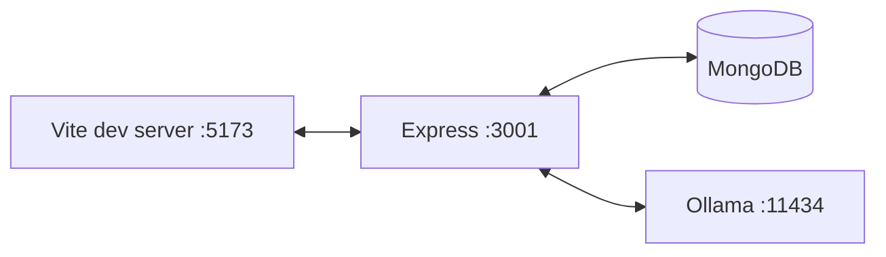

# High-Level Design (HLD)

## System context (C4 L1)

```mermaid
flowchart TB
  User((User)) --> UI[Synapse UI (Browser)]
  UI -->|Socket.IO + HTTP| Backend[Synapse Backend]
  Backend -->|Reads/Writes| Mongo[(MongoDB)]
  Backend -->|Inference calls| Ollama[Ollama]
  Backend -->|Fetches public pages| Internet[(Internet)]
  Backend -->|Files| LocalDisk[(Local disk: uploads, vectorstore)]
```

## Containers (C4 L2)

### Frontend (React/Vite)

Responsibilities:
- Auth (token storage + refresh)
- Socket connection + streaming output rendering
- Panels: memory, sandbox, agent console, triggers (partial)
- Chat session UX (list/history/delete/feedback)

Primary entry:
- `frontend/src/App.jsx`

### Backend (Express + Socket.IO)

Responsibilities:
- Auth endpoints + JWT validation for REST and sockets
- Chat pipeline:
  - normalize message/attachments
  - choose model (router)
  - optional RAG / web search / image reference search
  - stream response
  - persist chat + memory
- Agent pipeline (planner → tools → policy → audit)
- Uploads + static upload serving (with extension allowlist)
- Sandbox execution (JS) with sanitization + timeout + output caps

Primary entry:
- `backend/app.js`

## Major subsystems

### 1) Chat orchestration

Inputs:
- user message text
- optional file upload (audio/image/pdf)
- optional images array
- model preference

Outputs:
- streamed assistant reply
- optional attachments:
  - image URL(s) (reference images)
  - TTS audio URL
  - generated PDF URL

### 2) Agent tool execution

Goal:
- route a subset of requests into safe tools (git/filesystem/terminal/browser/screenshot).

Safety:
- allowlist/denylist + “confirm required” for risky actions
- audit log persisted to Mongo when available

### 3) Memory

- Facts extracted heuristically from user messages and persisted
- User profile aggregates top recent facts + preferences
- Episodic memory generates a session summary (heuristic + background LLM JSON refinement)

### 4) RAG

- FAISS index loaded from disk; if unavailable falls back to chunking `backend/data.txt` and lexical scoring.
- Retrieval includes “out-of-domain rejection” via thresholds:
  - similarity score window
  - minimal lexical overlap

### 5) Sandbox execution (HTTP)

- Purpose: allow users to run small JS snippets safely.
- Safety:
  - sanitization pass replaces dangerous patterns
  - strict timeout + output caps
  - optional Docker hardened execution in production mode

## Non-functional requirements (observed)

- Responsiveness:
  - streaming tokens via socket events
  - chunk flush throttling in frontend
- Resource constraints:
  - VRAM-aware queues (single concurrency for vision/TTS, limited reasoning concurrency)
- Safety:
  - JWT auth for REST + sockets
  - rate limiting (HTTP + socket event counters)
  - tool policy evaluation + audit logging
  - blocks internal network targets for browser tool

## Deployment shape (local-first)

Typical local dev:



Production considerations:
- Provide strong `JWT_SECRET`/`JWT_REFRESH_SECRET`
- Set `CORS_ORIGINS` to the deployed frontend origin(s)
- Ensure uploads directory permissions and consider pruning strategy

