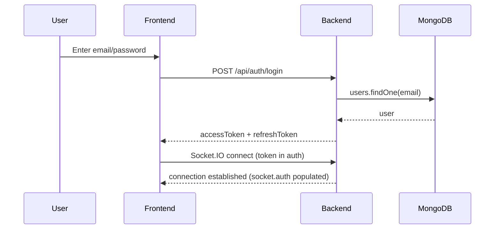
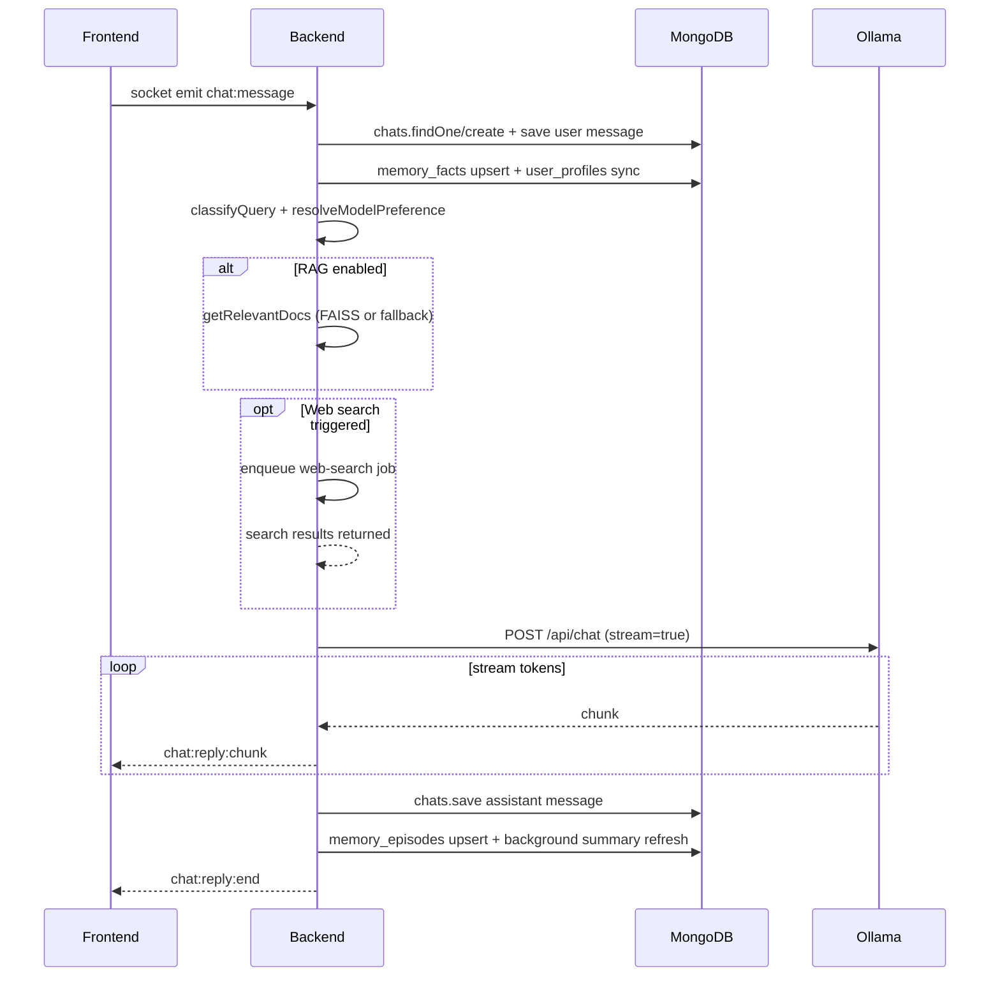
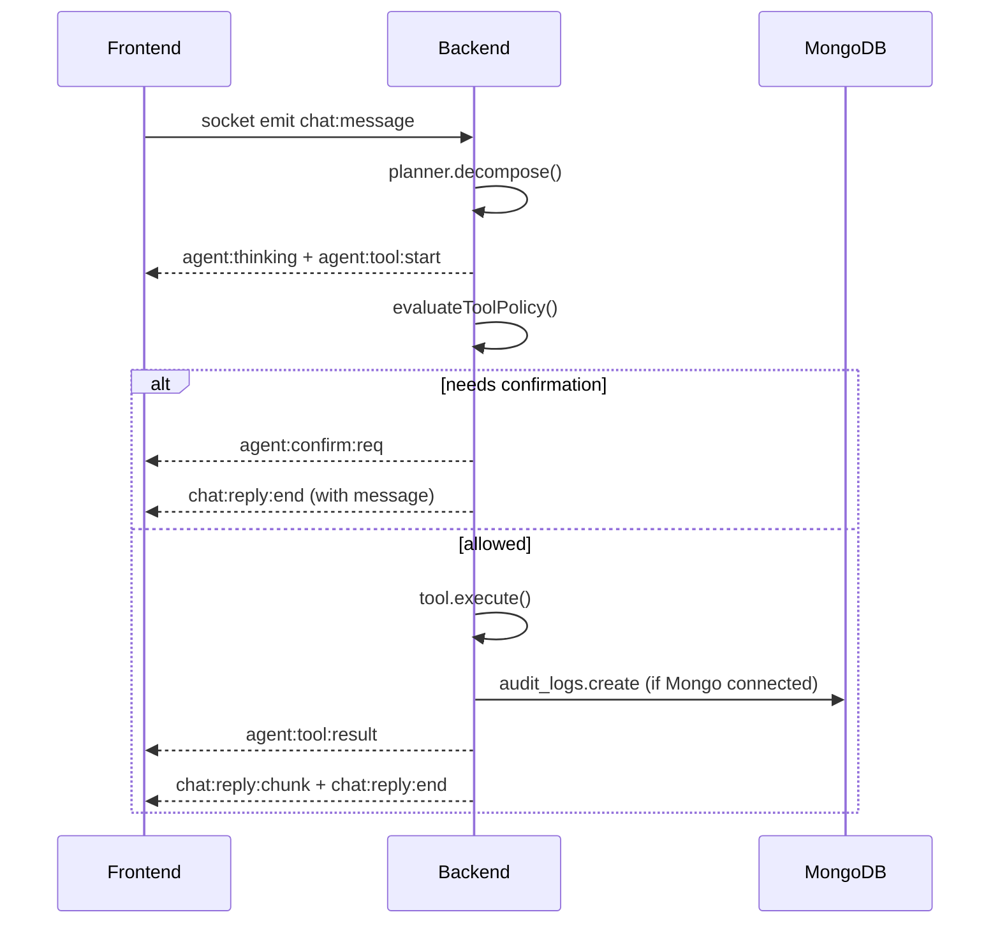
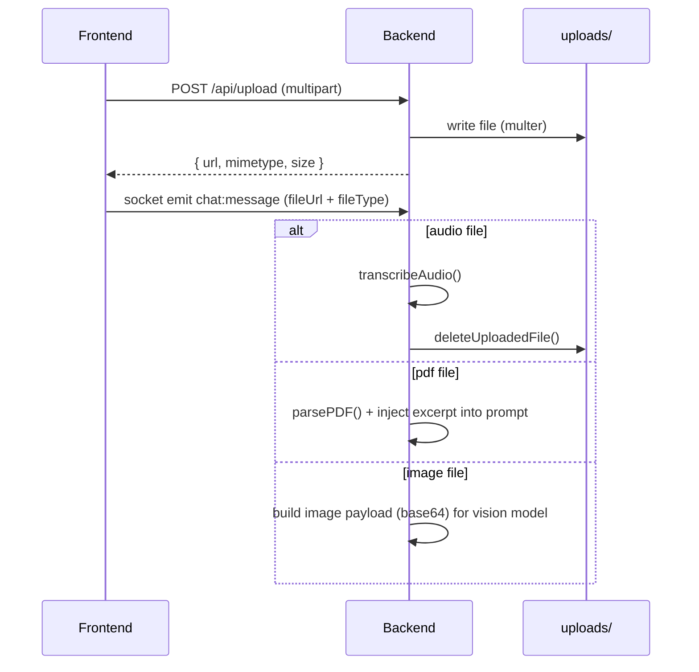
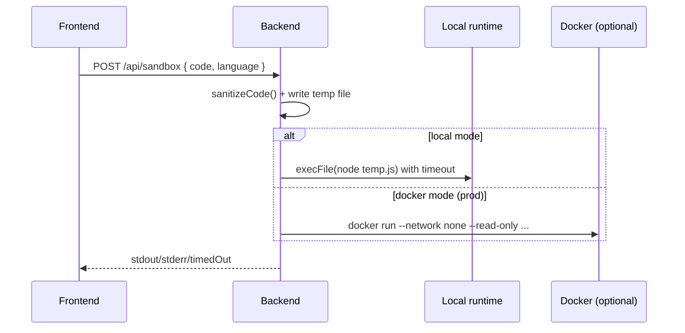
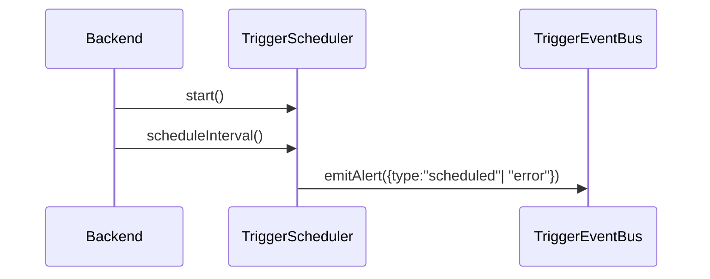

# Data Flow & Sequences

This doc focuses on end-to-end flows across frontend ↔ backend ↔ dependencies.

## Auth: login + socket connect

## Chat: standard message (streaming)

## Chat: agentic tool turn

## Upload: file → context injection

## Sandbox: run JS (HTTP)

## Triggers: scheduler → alert

